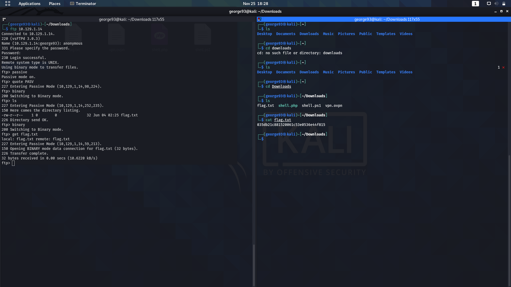

## Fawn

1. Port enumeration using nmap

	

2. Port 21: FTP

	- [Remote access FTP](https://docs.oracle.com/cd/E19120-01/open.solaris/819-1634/remotehowtoaccess-87541/index.html)

	- [FTP Exploitations](https://www.globalscape.com/blog/top-4-ftp-exploits-used-hackers)

4. Exploit

	
	
	Need to use passive mode to get files