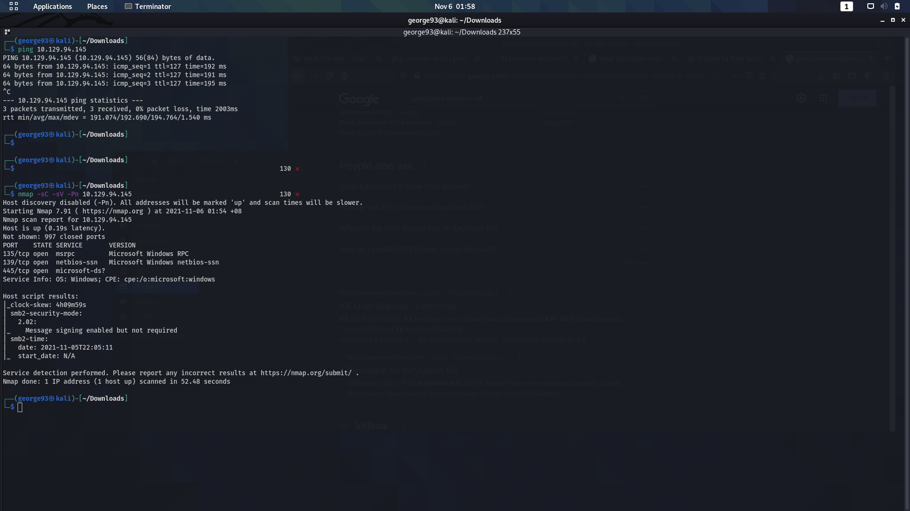

## Dancing:

1. nmap -sC -sV -Pn IP

	

2. Port 135: Windows RPC

	- Vulnerable to exploits

	- [Link #1](https://www.speedguide.net/port.php?port=135)

	- [Link #2](https://book.hacktricks.xyz/pentesting/135-pentesting-msrpc)

3. Port 139, 445: SMB

	-  Enumeratable and exploitable

	-  [Link #1](https://arnavtripathy98.medium.com/smb-enumeration-for-penetration-testing-e782a328bf1b)

4. Enumerate Host using SMB Client

	
	
	

	Navigate through `Amy.J` and `James.P` and run `get` to get `flag.txt`

## SMB (Server Message Block):

- SMB Configuration things:

	- [Link #1](https://askubuntu.com/questions/1265923/configuring-20-04-samba-for-smbv1)

	- [Link #2](https://www.linuxquestions.org/questions/linux-networking-3/unable-to-connect-with-smb1-no-workgroup-available-4175670814/)

- SMB Enumeration:

	- [Link #1](https://forum.hackthebox.com/t/starting-point-unable-to-connect-with-smb1/2786/6)

