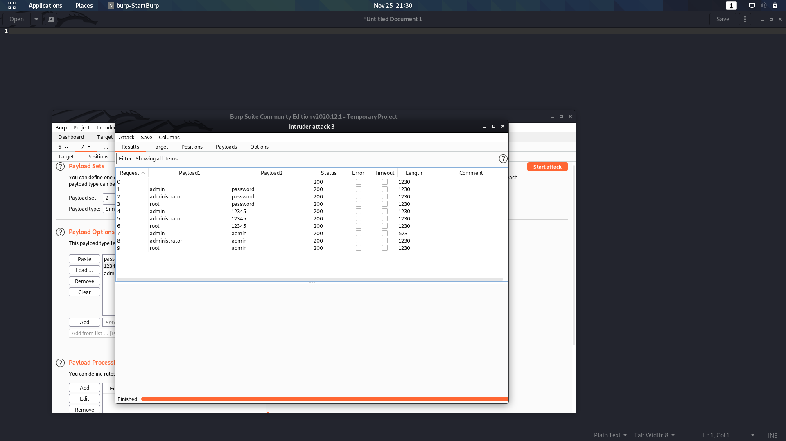

## Preignition

1. ping enumerate target using nmap

	```
	ping IP
	nmap -sC -sV -Pn IP
	```
	
	
	
2. Port 80
	
	- Webserver
	
	- Visit webserver and see whats up
	
	- Just a nginx page

3. Use dirbuster (or any directory enumeration tool) to enumerate web server

   
   

4. We found an admin.php page, lets visit it!

	
	

5. Use common default credentials to try to login (admin & admin)

	[Link for default credentials here!](https://github.com/nixawk/fuzzdb/blob/master/bruteforce/passwds/default_devices_users%2Bpasswords.txt)
	
	
	
6. Automate brute force using Burpsuite or any password cracking tool

	
	
	
	
